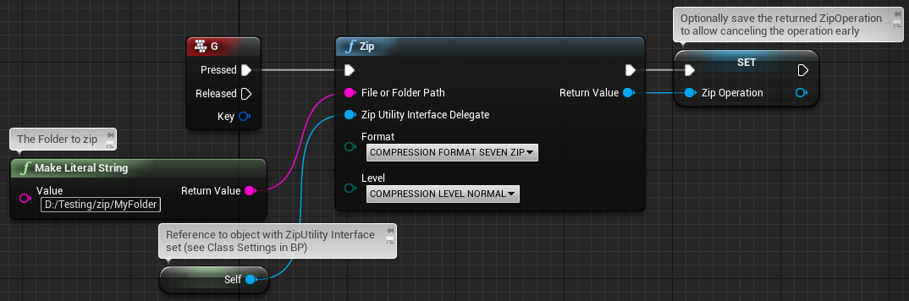
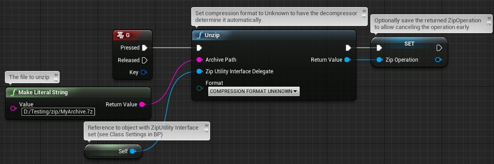
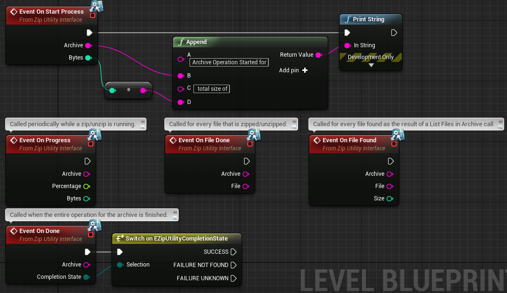
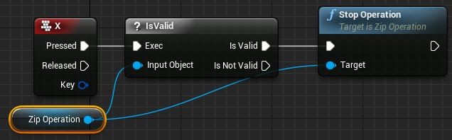

# ZipUtility Plugin

[](https://github.com/getnamo/ziputility-ue4/releases)
[](https://github.com/getnamo/ziputility-ue4/releases)

Event driven, blueprint accessible flexible 7zip compression, archiver, and file manipulation plugin for Unreal Engine 4. Built on [7zip-cpp](https://github.com/getnamo/7zip-cpp) modernization of the [SevenZip++](http://bitbucket.org/cmcnab/sevenzip/wiki/Home) C++ wrapper for accessing the 7-zip COM-like API in 7z.dll and 7za.dll.

Supports the following compression algorithms:
7Zip, GZip, BZip2, RAR, TAR, ISO, CAB, LZMA, LZMA86.


Plugin works in Windows only.

[Main Forum Thread](https://forums.unrealengine.com/showthread.php?95022-Plugin-ZipUtility-(7zip))


## Quick Install & Setup ##

 1.	[Download](https://github.com/getnamo/ZipUtility-ue4/releases)
 2.	Create new or choose project.
 3.	Browse to your project folder (typically found at Documents/Unreal Project/{Your Project Root})
 4.	Copy *Plugins* folder into your Project root.
 5.	Restart the Editor and open your project again. Plugin is now ready to use.
 
 
### Note on compiling
If you're recompiling for e.g. another engine build or packaging you will need to ensure you have ATL installed. 
1. Open Visual Studio Installer -> ```Modify```.
2. Click on the ```Individual components``` and scroll down to ```Visual C++ ATL for x86 and x64```.
3. *(Optional)* It's probably a good idea to ensure you have ```Visual C++ MFC for x86 and x64``` included as well.
4. After installation has completed, the plugin should auto-detect your ATL include location and compile correctly.

## Blueprint Access

Right click anywhere in a desired blueprint to access the plugin Blueprint Function Library methods. The plugin is completely multi-threaded and will not block your game thread, fire and forget.


*Optional but highly recommended:* Add `ZipUtilityInterface` to your blueprint if you wish to be notified of the progress, e.g. when your archive has finished unzipping or if you wish to display a progress bar.


After you've added the interface and hit Compile on your blueprint you'll have access to the Progress and List events


They're explained in further detail below.

## Zipping and Compressing Files

To Zip up a folder or file, right click your event graph and add the `Zip` function.

Specify a path to a folder or file as a target.

Leave the Compression format to the default SevenZip or specify a format of choice, the plugin automatically appends the default extension based on the compression format. Note that not all compression formats work for compression (e.g. RAR is extract only).



## Unzipping and Extracting Files

To Unzip up a file, right click your event graph and add the `Unzip` function.

Specify the full path to a suitable archive file.

The plugin automatically detects the compression format used in the archive, but you can alternatively specify a specific format using the `UnzipWithFormat` method.



## Listing Contents in an Archive

To list files in your archive, right click your event graph and add the `ListFilesInArchive` function.

Specify the full path to a suitable archive file. This function requires the use of the `ZipUtilityInterface` callback `OnFileFound`, so ensure you have `ZipUtilityInterface` added to your blueprint.


The `OnFileFound` event gets called for every file in the archive with its path and size given in bytes. This function does not extract the contents, but instead allows you to inspect files before committing to extracting their contents.

## Events & Progress Updates

By right-clicking in your blueprint and adding various `ZipUtility` events, you can get the status of zip/unzip operations as they occur. All callbacks are received on the game thread. To receive callbacks you must satisfy two requirements:

1. Implement the `ZipUtilityInterface` interface in your blueprint from the Class Settings menu
2. Pass a reference to `self` (or a reference to the class that implements `ZipUtilityInterface`) to all zip/unzip functions

All events pass along the name of the archive being operated on. Since multiple events can be running in parallel, the archive name is useful to uniquely match events with operations.

### Event Table

| Event  | Details |
| ------------- | ------------- |
| `OnStartProcess`  | Called when the zip/unzip operation begins  |
| `OnProgress`  | Called periodically while a zip/unzip operation is running to provide the overall status of the operation  |
| `OnFileDone` | Called for every file that is done being zipped/unzipped |
| `OnDone` | Called when the entire zip/unzip operation has completed |
| `OnFileFound` | Called for every file that is found as the result of a `ListFilesInArchive` call |



## Stopping Operations

Most of the Zip and Unzip methods return a pointer to a `ZipOperation`. This pointer can be used to terminate an operation that is still running by calling the `StopOperation` function.

The returned pointer to `ZipOperation` will be Garbage Collected if it is not stored as an Object Reference or in C++ in a `UPROPERTY` declared pointer. So don't store `ZipOperation` as a soft reference/pointer. It is safe to completely ignore the returned `ZipOperation` if you do not care about manually terminating the operation.



## Convenience File Functions

### Move/Rename a File

Specify full path for the file you wish to move and it's destination


To rename it, simply change the destination name


### Create/Make Directory


### List Contents of Folder

Expects self to be a `FileListInterface`


## C++

### Setup

To use the C++ code from the plugin add it as a dependency module in your project build.cs e.g.

```c#
PublicDependencyModuleNames.AddRange(new string[] { "Core", "CoreUObject", "Engine", "InputCore", "ZipUtility"});
```

then ```#include "ZipFileFunctionLibrary.h"``` in the places where you'd like to use the plugin functionality.

### [Lambda](http://en.cppreference.com/w/cpp/language/lambda)

#### [UnzipWithLambda](https://github.com/getnamo/ZipUtility-ue4/blob/master/Source/ZipUtility/Public/ZipFileFunctionLibrary.h#L63)

call the static function with *done* and *progress* callback lambdas e.g. if you're interested in both

```c++
UZipFileFunctionLibrary::UnzipWithLambda(FString("C:/path/to/your/zip.7z"),
    []()
    {
         //Called when done
    },
    [](float Percent)
    {
         //called when progress updates with % done
    });
```

replace either with nullptr if you're not interested in that callback

#### [ZipWithLambda](https://github.com/getnamo/ZipUtility-ue4/blob/master/Source/ZipUtility/Public/ZipFileFunctionLibrary.h#L80)

call the static function with *done* and *progress* callback lambdas e.g. if you're interested in both

```c++
UZipFileFunctionLibrary::ZipWithLambda(FString("C:/path/to/your/zip.7z"),
    []()
    {
         //Called when done
    },
    [](float Percent)
    {
         //called when progress updates with % done
    });
```

replace either with nullptr if you're not interested in that callback

### Your own class with [IZipUtilityInterface](https://github.com/getnamo/ZipUtility-ue4/blob/master/Source/ZipUtility/Public/ZipUtilityInterface.h)

Let's say you have a class called `UMyClass`. You then add the `IZipUtilityInterface` to it via multiple inheritance e.g.

```c++
class UMyClass : public UObject, public IZipUtilityInterface
{
   GENERATED_BODY()
   ...
};
```

Because the events are of the type [BlueprintNativeEvent](https://docs.unrealengine.com/latest/INT/Programming/UnrealArchitecture/Reference/Functions/Specifiers/BlueprintNativeEvent/) you add the C++ implementation of the events like so

```c++
class UMyClass : public UObject, public IZipUtilityInterface
{
    GENERATED_BODY()
    ...

    //event overrides
    virtual void OnProgress_Implementation(const FString& archive, float percentage, int32 bytes) override;
    virtual void OnDone_Implementation(const FString& archive, EZipUtilityCompletionState CompletionState) override;
    virtual void OnStartProcess_Implementation(const FString& archive, int32 bytes) override;
    virtual void OnFileDone_Implementation(const FString& archive, const FString& file) override;
    virtual void OnFileFound_Implementation(const FString& archive, const FString& file, int32 size) override;
};
```

ensure you have at least an empty implementation for each function

```c++
void UMyClass::OnProgress_Implementation(const FString& archive, float percentage, int32 bytes)
{
    //your code here
}
```

To call a `ZipUtility` function you first get a valid pointer to your class (I leave that up to you) e.g.

```c++
UMyClass* MyZipClass = NewObject<UMyClass>(); //or you may already have a valid pointer from allocating elsewhere
```

then to e.g. unzip you pass the pointer to your class with the `IZipUtilityInterface` as your second parameter (and if you use them, any other optional parameters such as compression format). If you are calling the zip functions from within the class that implements `IZipUtilityInterface` then you can simply pass `this`:

```c++
UZipFileFunctionLibrary::Unzip(FString("C:/path/to/your/zip.7z"), MyZipClass);
```

See [ZipFileFunctionLibrary.h](https://github.com/getnamo/ZipUtility-ue4/blob/master/Source/ZipUtility/Public/ZipFileFunctionLibrary.h) for all the function signatures.

See [ZULambdaDelegate.h](https://github.com/getnamo/ZipUtility-ue4/blob/master/Source/ZipUtility/Private/ZULambdaDelegate.h) for an example class using the above setup to convert `IZipUtilityInterface` interface calls into lambda functions.


### Windows Utility

For windows utility functions, the callback setup is similar, kindly refer to [WindowsFileUtilityFunctionLibrary.h](https://github.com/getnamo/ZipUtility-ue4/blob/master/Source/WindowsUtility/Public/WindowsFileUtilityFunctionLibrary.h) which may use [IWFUFileListInterface](https://github.com/getnamo/ZipUtility-ue4/blob/master/Source/WindowsUtility/Public/WFUFileListInterface.h) or [IWFUFolderWatchInterface](https://github.com/getnamo/ZipUtility-ue4/blob/master/Source/WindowsUtility/Public/WFUFolderWatchInterface.h) depending on functions used.

## License

MIT for ZipUtility and 7z-cpp

LGPL for 7za.dll, LGPL + Unrar for 7z.dll

See license file for details.

## Help
Add any issues you run across to https://github.com/getnamo/ZipUtility-ue4/issues

or post to the [unreal forum thread](https://forums.unrealengine.com/showthread.php?95022-Plugin-ZipUtility-(7zip)).

